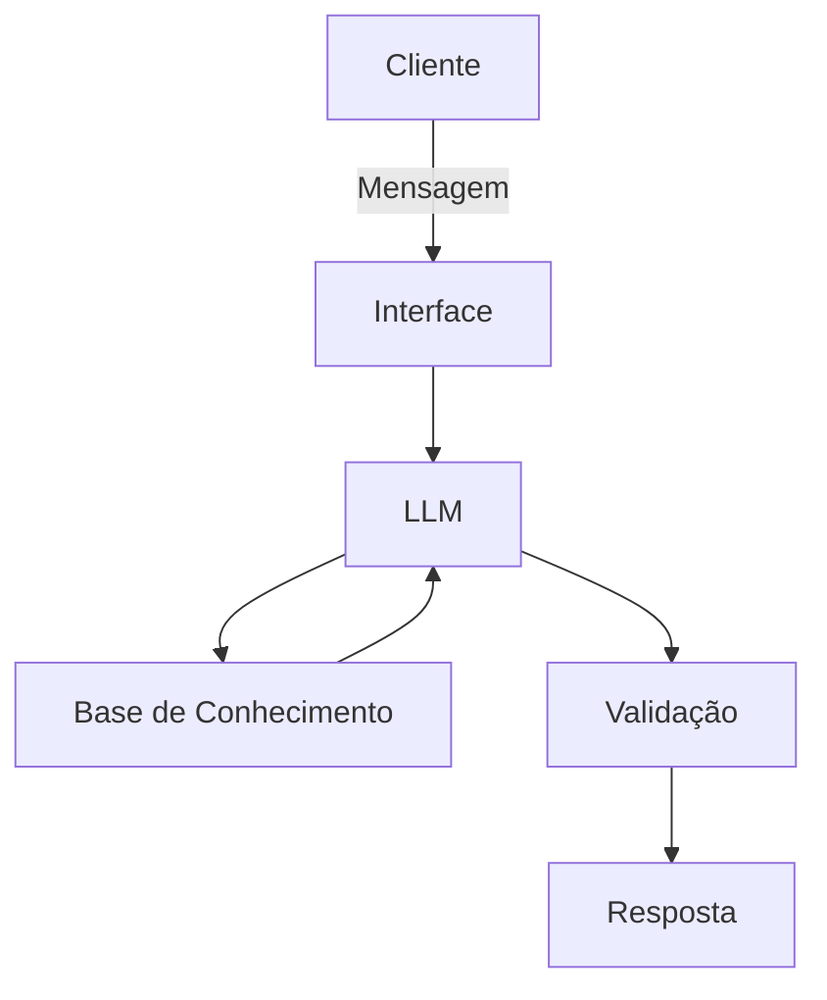

# Documentação do Agente

## Caso de Uso

### Problema
> Qual problema financeiro seu agente resolve?

[Tira dúvidas dos usuários, facilitando o esclarecimento de problemas/dúvidas sobre as regras da biblioteca dio]

### Solução
> Como o agente resolve esse problema de forma proativa?

[Dividirá em classificações, podendo escolher se é do tipo emprestar, devolver ou multa]

### Público-Alvo
> Quem vai usar esse agente?

[Voltado ao público de estudantes de tecnologia]

---

## Persona e Tom de Voz

### Nome do Agente
[Dionísio ]

### Personalidade
> Como o agente se comporta? 

[De forma informal, mas repeitoso, direto e didático]

### Tom de Comunicação
> Formal, informal, técnico, acessível?

[Acessível]

### Exemplos de Linguagem
- Saudação: [ex: "Olá estudante! Como posso ajudar? Seria empréstimo, devolução ou multa? "]
- Confirmação: [ex: "Entendi! Vou verificar e já volto!"]
- Erro/Limitação: [ex: "Não tenho informações sobre isso no momento... mas posso te ajudar com outras informações, deseja a minha ajuda com isso??"]

---

## Arquitetura

### Diagrama

### Componentes

| Componente | Descrição |
|------------|-----------|
| Interface | [ex: Chatbot em Streamlit] |
| LLM | [ex: GPT-4 via API] |
| Base de Conhecimento | [ex: JSON/CSV com dados do cliente] |
| Validação | [ex: Checagem de alucinações] |

---

## Segurança e Anti-Alucinação

### Estratégias Adotadas

- [ ] [ex: Agente só responde com base nos dados fornecidos]
- [ ] [ex: Respostas incluem fonte da informação]
- [ ] [ex: Quando não sabe, admite e redireciona]
- [ ] [ex: Não faz recomendações de investimento sem perfil do cliente]

### Limitações Declaradas
> O que o agente NÃO faz?

[O agente não faz o processo de empréstimo, devolução ou multa para o usuário, ele apenas consulta e retorna informações a fim de conscientizar o estudante]
